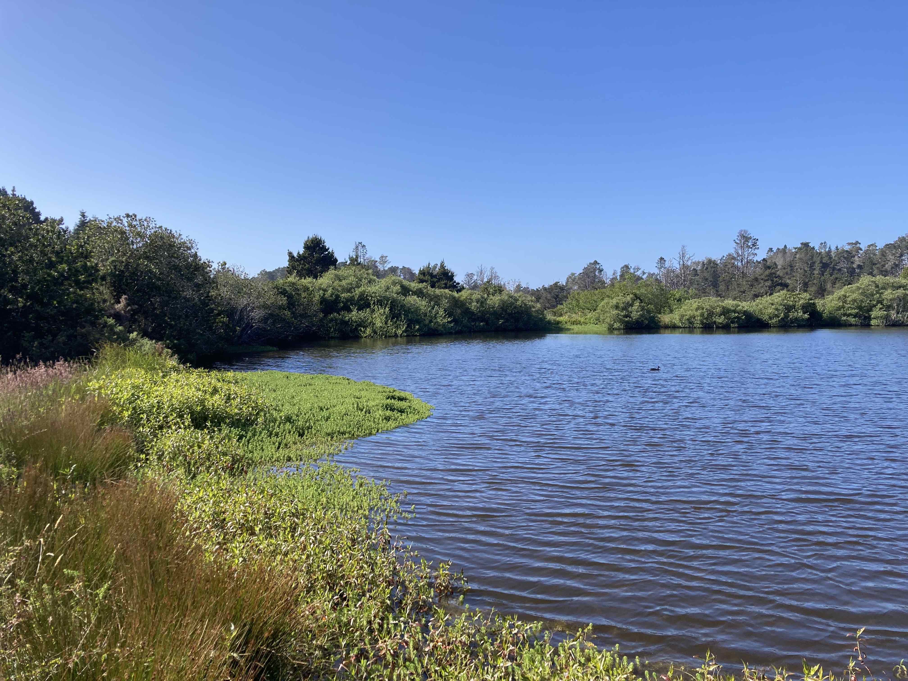

# Duckpond

Duckpond is a very small data lake. :-)

Duckpond is built by the [Caspar Water System](https://github.com/jmacd/caspar.water).

Duckpond writes timeseries data into multi-Parquet file databases and
assembles them for export using DuckDB.  A sibling project [Noyo Blue
Economy](https://github.com/jmacd/noyo-blue-econ) shows how to combine
this output within [Observable
Framework](https://observablehq.com/framework/) markdown.

Warning! Work-in-progress. This is really not working much at all.



## Resource categories

### HydroVu

A receiver for www.hydrovu.com environmental monitoring data.  To
instantiate one of these, for example:

```
apiVersion: www.hydrovu.com/v1
kind: HydroVu
name: noyo-harbor
desc: Noyo Harbor Blue Economy
spec:
  key: ...
  secret: ...
```

Configure key and secret fields using values supplied by the HydroVu system.

### Backup

An exporter for backing up to a storage bucket.

```
apiVersion: github.com/jmacd/duckpond/v1
kind: Backup
name: cloudflare
desc: Backup to Cloudflare R2
spec:
  bucket: noyoharbor
  region: ...
  key: ...
  secret: ...
  endpoint: ...
```

Configure region, key, secret, and endpoint fields using values
supplied by your service provider.

### Copy

Loads from a Backup storage bucket.

```
apiVersion: github.com/jmacd/duckpond/v1
kind: Copy
name: cloudflare
desc: Backup from storage
spec:
  bucket: noyoharbor
  region: ...
  key: ...
  secret: ...
  endpoint: ...
  backup_uuid: 6fe1e0e1-b262-4d99-ae6f-3cae39e1196a
```

Configure region, key, secret, and endpoint the same as you 
would for the corresponding Backup.

### Inbox

Ingest files from a local directory.

```
apiVersion: github.com/jmacd/duckpond/v1
kind: Inbox
name: csvin
desc: CSV inbox
spec:
  pattern: /home/user/inbox/csv/**
```

### Scribble

Synthetic data generator for testing.

```
apiVersion: github.com/jmacd/duckpond/v1
kind: Scribble
name: first-scribble
desc: Test data generator
spec:
  count_min: 5
  count_max: 10
  probs:
    tree: 0.05
    table: 0.4
```

## Usage

### Init

To initialize a new pond in the current working directory or `$POND`,
if set.  The pond directory is named ".pond".  To create a new pond:

```
duckpond init
```

### Apply

To apply a resource definition, such as to create a new temporal data
set.  For example:

```
duckpond apply -f noyo.yaml
```

### Run

Fetches new data from registered resources.  For example:

```
duckpond run
```

### Check

Determines whether expected files are present in the pond and various
other consistency checks.  WIP: Simply prints the unexpected files.

```
duckpond check
```

### Export

Writes a single Parquet file per instrument definition into the
current directory for a given resource type and UUID.

```
POND=$HOME/.pond duckpond export {Resource}/{UUID}
```
