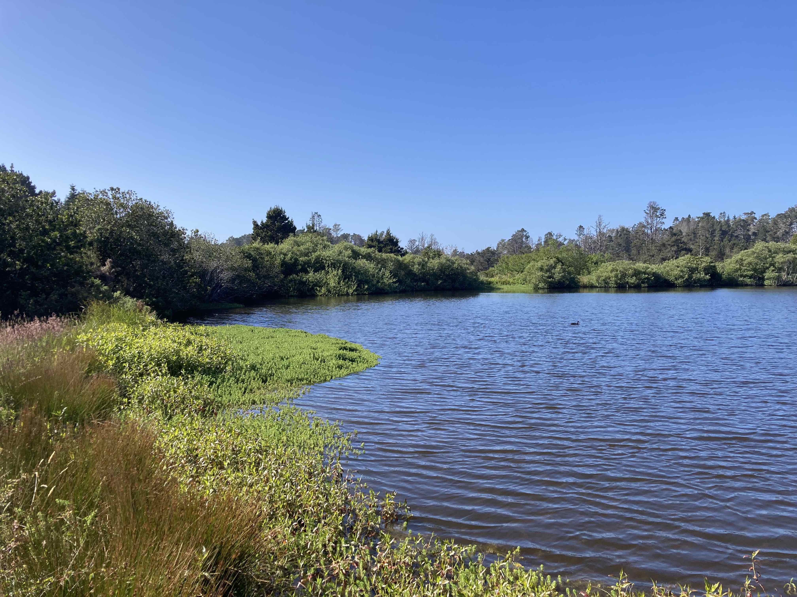

# DuckPond

[](https://scorecard.dev/viewer/?uri=github.com/jmacd/duckpond)
[](https://slsa.dev)

DuckPond is a query-native filesystem for time-series data, built on
Apache Arrow, DataFusion, and Delta Lake.  Every filesystem object can
be queried with SQL, and SQL queries create new filesystem objects that
appear as native files and directories.

Built by the [Caspar Water System](https://github.com/jmacd/caspar.water).



## What DuckPond Does

DuckPond gives you a **transactional filesystem** where files are
first-class data.  It has two operating modes:

- **Pond mode** (`$POND`): A persistent, transactional filesystem
  backed by Delta Lake.  Every write is atomic.  Files can be raw
  bytes, queryable Parquet tables, or multi-version time-series.
  The pond replicates to S3-compatible storage for backup and
  cross-machine access.

- **Host mode** (`host+`): A read-only view of the local filesystem
  where the same query and factory tools work directly on host files
  -- no pond initialization required.

Both modes use the same URL scheme system and the same SQL engine.
A CSV file on your local disk and a time-series inside a remote
pond backup are queried with the same `pond cat --sql` syntax.

### Replication and Cross-Pond Import

Every pond can push incremental backups to S3-compatible storage
(MinIO, AWS S3).  From any other machine, you can:

- **Discover** remote ponds: `pond run host+remote:///config.yaml list-ponds`
- **Browse** backup contents: `pond run host+remote:///config.yaml show`
- **Import** a subtree into a local pond for querying

The `host+remote://` pattern lets you point at a YAML config file on
your local disk and interact with a remote backup without initializing
a pond first.  This makes it easy to inspect what a remote machine has
collected before deciding what to pull down.

## Quick Start

```bash
# Build
make build

# Run unit tests
make test

# Initialize a pond and try it out
export POND=/tmp/mypond
pond init
pond mkdir /data
echo "hello" | pond copy - /data/greeting.txt
pond list /**
pond cat /data/greeting.txt

# Query a local CSV with SQL (no pond needed)
pond cat host+csv:///tmp/data.csv --format=table --sql "SELECT * FROM source"

# Run a factory from a local config file (no pond needed)
pond run host+remote:///path/to/backup-config.yaml list-ponds
```

## Developer Guide

### Prerequisites

- Rust stable toolchain (see `rust-toolchain.toml`)
- Docker (for integration tests and site deployment)
- Node.js >= 22 (for browser tests and vendor download)

### Daily Workflow

```bash
make build          # Build pond binary (debug)
make test           # Run all unit tests
make integration    # Build Docker test image + run integration tests
make check          # fmt + clippy + test (CI equivalent)
```

Run `make` with no arguments to see all available targets.

### One-Time Setup

Download JavaScript vendor dependencies for offline site generation:

```bash
make vendor         # Downloads DuckDB-WASM, Observable Plot, D3
```

This populates `crates/sitegen/vendor/dist/` (gitignored, ~35MB).
After this, `pond run sitegen build` produces sites that work without
network access.

### Repository Structure

```
crates/
  tinyfs/       Pure filesystem abstractions (FS, WD, Node, path resolution)
  tlogfs/       Delta Lake persistence (OpLog, transactions, DataFusion)
  steward/      Transaction orchestration, control table, factory execution
  provider/     URL-based data access, factory registry, table providers
  cmd/          CLI commands (pond init/list/cat/copy/run/...)
  sitegen/      Static site generator (factory)
  remote/       S3 backup & replication (factory)
  hydrovu/      HydroVu API collector (factory)
  utilities/    Shared helpers (glob, chunked files, perf tracing)

scripts/        Shared deployment scripts
testsuite/      Integration tests (Docker-based)
  tests/        Individual test scripts (NNN-description.sh)
  browser/      Puppeteer browser validation tests

docs/           Architecture and design documentation
water/          Water monitoring demo site
septic/         Septic system demo site
noyo/           Noyo Harbor demo site
```

### Architecture

See [docs/duckpond-overview.md](docs/duckpond-overview.md) for the
full architecture description.  Key layers (bottom to top):

| Layer | Crate | Role |
|-------|-------|------|
| Filesystem | `tinyfs` | Pure abstractions: FS, WD, Node, path resolution |
| Persistence | `tlogfs` | Delta Lake storage, OpLog, DataFusion integration |
| Orchestration | `steward` | Transactions, control table, factory lifecycle |
| Data Access | `provider` | URL schemes, factory registry, table providers |
| CLI | `cmd` | User-facing commands |

### CLI Reference

See [docs/cli-reference.md](docs/cli-reference.md) for the complete
command reference.  Common commands:

```bash
pond init                           # Create a new pond
pond list '/**'                     # List all entries
pond cat /path/to/file              # Read a file
pond cat --sql "SELECT * FROM source WHERE ..." /path  # Query a table
pond copy host:///local/file /pond/path                # Import a file
pond copy host+series:///data.parquet /pond/series      # Import time-series
pond mkdir /dir                     # Create a directory
pond mknod <factory> /path --config-path config.yaml   # Install a factory
pond run /path/to/factory <command>                     # Execute a factory
pond log                            # Transaction history
```

**Host mode** (no pond required):
```bash
pond cat host+csv:///tmp/data.csv --format=table       # Query a local CSV
pond run host+remote:///config.yaml list-ponds          # Browse S3 backups
pond run host+sitegen:///site.yaml build ./dist         # Generate a site
```

### Integration Tests

Tests live in `testsuite/tests/` as numbered shell scripts.  Each test
runs in a fresh Docker container with the `pond` binary:

```bash
make test-image                     # Build the test Docker image
make integration                    # Run all tests (skips browser tests)
make integration-all                # Run all tests including browser

# Run a single test
cd testsuite && ./run-test.sh 201

# Run interactively (explore in container)
cd testsuite && ./run-test.sh --interactive
```

### Demo Sites

Each demo site (water/, septic/, noyo/) rsyncs data from its remote
machine and runs everything locally:

```bash
# First time: configure your site
cp water/deploy.env.example water/deploy.env
# Edit deploy.env with your remote host and S3 credentials

# Site workflow (all run locally)
cd water
./setup-local.sh          # rsync data + init pond + install factories
./run-local.sh            # rsync new data + ingest
./generate-local.sh       # build static site + preview
./update-local.sh         # after editing YAML/templates
```

Credentials are kept in `deploy.env` (gitignored) — never in the YAML
configs checked into the repository.  Remote machines use container
images built by GitHub Actions.

## Documentation

| Document | Contents |
|----------|----------|
| [CLI Reference](docs/cli-reference.md) | Complete command syntax and examples |
| [Architecture Overview](docs/duckpond-overview.md) | System design and crate map |
| [System Patterns](docs/duckpond-system-patterns.md) | Transaction model, factories, providers |
| [Sitegen Design](docs/sitegen-design.md) | Static site generator architecture |
| [Cross-Pond Import](docs/cross-pond-import-status.md) | Foreign pond import status |
| [Large File Storage](docs/large-file-storage-implementation.md) | Content-addressed storage for large files |
| [Releasing](RELEASING.md) | Release process and supply chain security |

## License

Apache-2.0 — see [LICENSES/](LICENSES/) for details.
