# Component Relationships and Data Flow

## Architecture Layers (Dependencies Flow Downward)

```mermaid
graph TD
    CLI["🎯 Pond CLI (cmd)<br/>Commands & UI"] 
    STEWARD["🚢 Steward<br/>Transaction Coordination"]
    TLOGFS["📝 TLogFS<br/>Delta Lake Persistence"] 
    TINYFS["📁 TinyFS<br/>Filesystem Abstraction"]
    
    EXTERNAL_DF["📊 DataFusion<br/>SQL Engine"]
    EXTERNAL_ARROW["🏹 Arrow<br/>Data Structures"]
    EXTERNAL_DELTA["🔺 Delta Lake<br/>Storage Format"]
    
    CLI --> STEWARD
    STEWARD --> TLOGFS
    TLOGFS --> TINYFS
    
    TLOGFS --> EXTERNAL_DF
    TLOGFS --> EXTERNAL_ARROW
    TLOGFS --> EXTERNAL_DELTA
    
    style CLI fill:#e1f5fe
    style STEWARD fill:#f3e5f5
    style TLOGFS fill:#e8f5e8
    style TINYFS fill:#fff3e0
    style EXTERNAL_DF fill:#fafafa
    style EXTERNAL_ARROW fill:#fafafa
    style EXTERNAL_DELTA fill:#fafafa
```



## Transaction Context Flow

```mermaid
sequenceDiagram
    participant CLI as 🎯 CLI Command
    participant SHIP as 🚢 Ship
    participant STG as 🔒 StewardTransactionGuard
    participant TG as 📝 TransactionGuard<TLogFS>
    participant STATE as 💾 persistence::State
    participant OP as ⚙️ TLogFS Operation
    
    CLI->>SHIP: begin_transaction(args)
    SHIP->>TG: persistence.begin()
    TG->>STATE: create State
    TG-->>STG: wrap in StewardTransactionGuard
    STG-->>CLI: return guard
    
    CLI->>STG: steward_guard.state()
    STG->>STATE: extract State
    STATE-->>CLI: persistence::State
    
    CLI->>OP: operation(persistence_state)
    OP->>STATE: use for persistence
    
    CLI->>STG: commit()
    STG->>TG: commit with metadata
    TG->>STATE: finalize transaction
```



## File Access Pattern

```mermaid
graph LR
    PATH["🔗 Path String<br/>'/data/file.parquet'"] 
    WD["📂 TinyFS::WD<br/>Working Directory"]
    LOOKUP["🔍 Lookup Result<br/>Found(NodePath)"]
    PATHED["📋 Pathed&lt;FileHandle&gt;<br/>Path + Handle"]
    HANDLE["🗂️ FileHandle<br/>Arc&lt;Mutex&lt;Box&lt;dyn File&gt;&gt;&gt;"]
    OPLOG["📄 OpLogFile<br/>{node_id, part_id, ...}"]
    
    PATH --> WD
    WD -->|resolve_path()| LOOKUP
    LOOKUP --> PATHED
    PATHED -->|.handle| HANDLE
    HANDLE -->|.get_file().await<br/>lock().await<br/>as_any()<br/>downcast_ref()| OPLOG
    
    style OPLOG fill:#e8f5e8
```

## Component Responsibilities

### 🎯 **Pond CLI (cmd)**
- **Purpose**: User interface and command orchestration
- **Responsibilities**: 
  - Parse command arguments
  - Format output for users
  - Coordinate high-level operations
- **Key Rule**: Thin layer - delegate all business logic to Steward
- **Dependencies**: Steward only

### 🚢 **Steward**  
- **Purpose**: Dual filesystem coordination and transaction management
- **Responsibilities**:
  - Begin/commit coordinated transactions
  - Crash recovery and metadata tracking
  - Control filesystem synchronization
- **Key Rule**: Coordinate but don't implement - delegate to TLogFS
- **Dependencies**: TLogFS, no business logic

### 📝 **TLogFS**
- **Purpose**: Delta Lake persistence with SQL capabilities
- **Responsibilities**:
  - Transaction guards and state management
  - Delta Lake operations and metadata
  - DataFusion integration for SQL queries
  - OpLog schema and versioning
- **Key Rule**: Never depend on Steward - receive State as parameter
- **Dependencies**: TinyFS, DataFusion, Arrow, Delta Lake

### 📁 **TinyFS**
- **Purpose**: Pure filesystem abstraction
- **Responsibilities**:
  - File/Directory/Symlink trait definitions
  - Path resolution and node management  
  - Metadata and entry type handling
- **Key Rule**: Pure abstraction - no business logic, no external dependencies
- **Dependencies**: Standard library only

## Dependency Rules Matrix

|            | CLI | Steward | TLogFS | TinyFS |
|------------|-----|---------|--------|--------|
| **CLI**    | ❌   | ✅       | ❌      | ❌      |
| **Steward**| ❌   | ❌       | ✅      | ❌      |
| **TLogFS** | ❌   | ❌       | ❌      | ✅      |
| **TinyFS** | ❌   | ❌       | ❌      | ❌      |

- ✅ = Allowed dependency
- ❌ = Forbidden (creates cycles or violates layering)

## Critical Interfaces

### **Transaction Threading Pattern**
```rust
// ✅ CORRECT: Thread State down the stack
async fn cli_command(steward: &mut Ship) -> Result<()> {
    let tx = steward.begin_transaction(args).await?;
    let state = tx.state()?; // Extract State from guard
    tlogfs_operation(state).await?; // Pass State down
    tx.commit().await?;
}

// ❌ WRONG: Don't pass guards across component boundaries
tlogfs_operation(&tx).await?; // Creates circular dependency
```

### **File Downcasting Pattern**  
```rust
// ✅ CORRECT: Use existing downcasting infrastructure
let file_arc = file_handle.handle.get_file().await;
let (node_id, part_id) = {
    let file_guard = file_arc.lock().await;
    let file_any = file_guard.as_any();
    let oplog_file = file_any.downcast_ref::<OpLogFile>()?;
    (oplog_file.get_node_id(), oplog_file.get_part_id())
};

// ❌ WRONG: Don't add new trait methods
trait File {
    fn extract_node_ids(&self) -> Option<(NodeID, NodeID)>; // Creates coupling
}
```

### **DataFusion Integration Pattern**
```rust
// ✅ CORRECT: Use DataFusion's ListingTable for multi-file access
let listing_table = ListingTableConfig::new(table_url)
    .with_listing_options(listing_options)
    .infer_schema(&ctx.state())
    .await?;

// ❌ WRONG: Don't create custom table implementations
struct GenericFileTable { ... } // Duplicates DataFusion functionality
```
